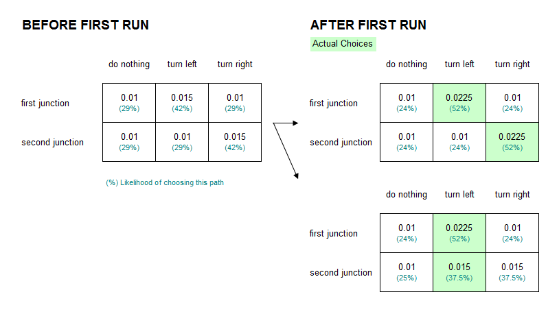
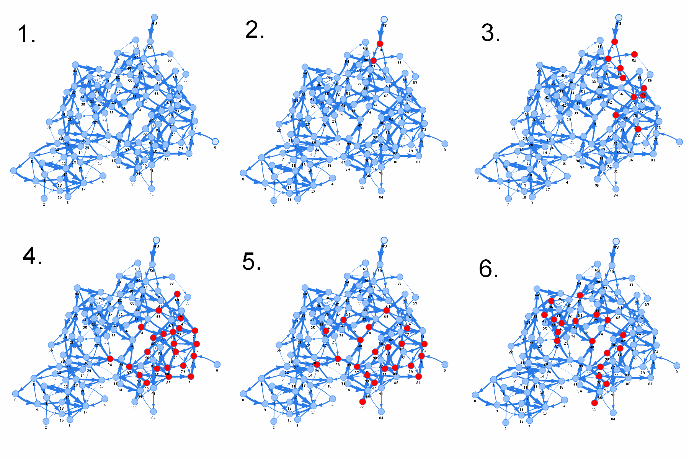

# fusspot

[](https://travis-ci.org/sdesalas/fusspot)

Fusspot is a learning engine I've been meaning to write for while now. Its only now that it has become relevant as I am building [nodebots](http://nodebots.io/).

##Grid

A fusspot [grid](Grid.js) is a weighted matrix of inputs to outputs. While you can train it to be biased towards certain responses with patience, it is non determinisic and will just as likely learn on its own or veer away from what it has learnt (ie, do what it likes rather than what its told). 

At present, links between inputs and ouputs (think squares in a game of chess) are biased positively or negatively depending on a combination of random choices and training/reinforcement which biases the likelyhood of those choices.

```js
var grid = new fusspot.Grid();
grid.output('red pill');
grid.output('blue pill');
grid.predict('left hand'); // 1/3 each pill, 1/3 nothing - and will remember its choice with until told otherwise.

grid.strengthen('left hand', 'red pill');
grid.strengthen('left hand', 'red pill');
grid.predict('left hand'); // will most likely say 'red pill', but not certainly.

grid.certain('left hand', 'blue pill');
grid.predict('left hand'); // will almost certainly say 'blue pill'.

grid.predict('right hand'); // what?? I never heard of a right hand! -> 1/3 each pill, 1/3 nothing
```

Another example. Note that the result of the last 2 calls will become reinforce with each use.

```js
var grid = new fusspot.Grid({ baseWeight: 0.01, learningRate: 0.5 }); // start at 0.01, 50% up/down when learning
grid.likely('first junction', 'turn left');
grid.likely('second junction', 'turn right');
grid.predict('first junction'); // probably 'turn left'
grid.predict('second junction'); // probably 'turn right'
```



While this is sufficient for very simplistic scenarios, more complex scenarios (think: time-series input from analog sensors) require inputs to be turned into vectors so that the engine is called with the vector signature covering a whole list of similar inputs rather than each individual one, I am currently doing this separately but might incorporate the process into this algorithm if I think it makes sense.

# Neural Network 

A fusspot [neural network](NeuralNetwork.js) is a learning engine ideal for performing [paralell signal processing](https://en.wikipedia.org/wiki/Parallel_multidimensional_digital_signal_processing) on multiple inputs and output channels concurrently. This becomes quite handy when trying to train a robot that is processing input from various sensors and learning behavioural patterns from actuator-sensor feedback loops while interacting with their enviroment.

Unlike [standard models](https://en.wikipedia.org/wiki/Types_of_artificial_neural_networks) of Neural Network rooted in mathematics, fusspot attempts to mimick biological networks by introducing a slight delay between firing neurons, which varies depending on the strength of the connection. This creates [travelling waves, oscillations and paterns](https://sdesalas.github.io/fusspot/) that vary in tandem with inputs.

The neural network can be trained by increasing or decreasing the strength of neural pathways used in the recent past. More closely imitating the kind of [Long Term Potentiation (LTP)](https://en.wikipedia.org/wiki/Long-term_potentiation) seen in biological networks.

Please note that while the content here touches on the academic, this is not a research paper. I'm just trying to get my robots to interact with the external world in a way that living creatures would.

```js
const NeuralNetwork = require('fusspot').NeuralNetwork;

var network = new NeuralNetwork(100);
network.on('fire', id => console.log(`Firing ${id}`));
network.nodes[43].fire();
```


